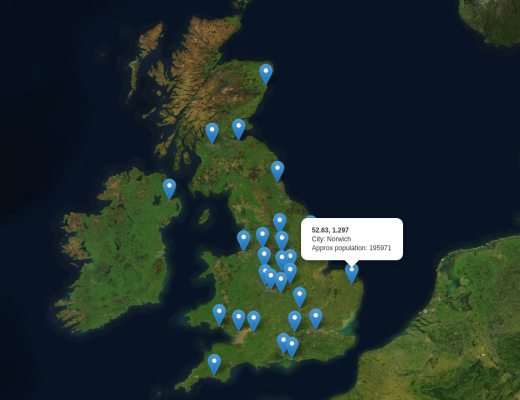
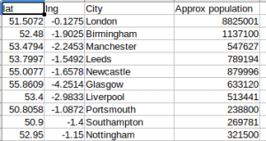

# csv2map
A fork of fail2ban-analyse providing more generic point location mapping from CSV containing coordinates and one or more data item(s) which form label(s).

Converts arbitrary size CSV input - latitude,longitude,label1[,label2,label3,...] to GeoJSON feature set, to plot all points as a map overlay

CSV must have exactly one header line, and it must contain at least as many columns as all the subsequent data.  There must be at least one data line, and at least one column of labels (min 3 columns in total)
The first column MUST be the decimal latitude and the second column MUST be the decimal longitude.  This will be assumed and headers ignored.
Each subsequent column contains the labels, which will be displayed (preceded by respective header column) on the relevant pop-up

Each popup on the map will contain the latitude and longitude in bold on the first line, and then contain an additional line for each additional column in the CSV
Each subsequent line of the pop-up will be in form "Header: data" and the feature 'name' property will be the first item of data (column 3)

Example html uses Mapbox / OpenStreetMap and by default shows satellite image view.  This can be customeised by modifying the html.  A free Mapbox API key is required to use Mapbox data

See header comments for more information (and fail2ban-analyse README)

## Use

- run _scripts/csv2geojson.py_ specifying input CSV file (and optionally output GeoJSON filename)
- Copy resulting output GeoJSON file and _web/locations-map.html_ into your web server directory
- edit _locations-map.html_ to enter your unique Mapbox API key (and change map display preferences if required)
- View web page in a browser :)

## Example outputs

Example shows a selection of the most populus UK cities, with approximate populations.  Image below shows the form of CSV used for input data (data credit: https://simplemaps.com/data/gb-cities)

## References

- https://leafletjs.com/
- https://www.mapbox.com/
- https://www.openstreetmap.org/
- https://github.com/jawj/OverlappingMarkerSpiderfier-Leaflet
- https://github.com/aaron555/fail2ban-analyse